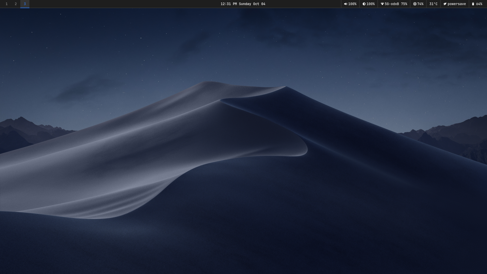

# debian-dotfiles

Personal collection of configuration files for a Sway desktop macOS Mojave-inspired (McMojave) rice on Debian, or for any other imperative distro.

Repository: https://github.com/ThePotDude/debian-dotfiles

## Screenshots




## Contents

| Folder     | Purpose                                  |
|------------|-------------------------------------------|
| alacritty  | Terminal emulator configuration           |
| fastfetch  | System information fetch tool configuration |
| gtk-3.0    | GTK 3 theme and appearance settings       |
| gtk-4.0    | GTK 4 theme and appearance settings       |
| sway       | Sway window manager configuration         |
| waybar     | Status bar configuration                  |
| wofi       | Application launcher configuration        |

## Requirements

These configs assume the following are already installed:

- sway
- waybar
- wofi
- swaybg (paste your preferred wallpaper in ~/Pictures/)
- alacritty
- fastfetch
- git (to clone the theme repositories)

The GTK configs also reference the following theme, icon theme, and cursor theme.
None of these are installed automatically. See the Themes section below.

- McMojave (GTK theme)
- Kora (icon theme)
- McMojave cursors (cursor theme)

## Installation

Clone the repository:

```
git clone https://github.com/ThePotDude/debian-dotfiles.git
cd debian-dotfiles
```

Run the install script to symlink the configs into place:

```
./install.sh
```

This will back up any existing configuration files before creating symlinks.

## Themes

The `gtk-3.0` and `gtk-4.0` configs point to specific theme, icon, and cursor packages.
These are not installed by `install.sh` and must be installed manually.

### McMojave (GTK theme)

Source: https://github.com/vinceliuice/McMojave-gtk-theme

Clone the repository and run the install script:

```
git clone https://github.com/vinceliuice/McMojave-gtk-theme.git
cd McMojave-gtk-theme
./install.sh
```

This installs the theme into `~/.themes/` (or `~/.local/share/themes/`). The configs in this
repo use the `Mojave-Dark-solid` variant, so install only that one by passing the color and
opacity flags:

```
./install.sh -c dark -o solid
```

Run `./install.sh --help` to see all available options (variants, accent colors, and so on).

### Kora (icon theme)

Source: https://github.com/bikass/kora

Clone the repository and copy the icon theme folders into your local icons directory:

```
git clone https://github.com/bikass/kora.git
cd kora
mkdir -p ~/.local/share/icons
cp -r kora kora-light kora-light-panel kora-pgrey ~/.local/share/icons/
```

You can also place them in `~/.icons/` instead. Refresh the icon cache if needed:

```
gtk-update-icon-cache ~/.local/share/icons/kora
```

### McMojave cursors (cursor theme)

Source: https://github.com/vinceliuice/McMojave-cursors

Clone the repository and run the install script:

```
git clone https://github.com/vinceliuice/McMojave-cursors.git
cd McMojave-cursors
./install.sh
```

This installs the `McMojave-cursors` theme into `~/.local/share/icons/` (or `~/.icons/`).

After installing all three, log out and back in (or restart Sway) for the changes to apply.

## Uninstalling

To remove the symlinks created by install.sh, delete them from your `~/.config` directory
and restore your backups if needed. Backups are created with a `.bak` suffix in the same
location as the original file.

## License

This project is licensed under the MIT License. See [LICENSE](LICENSE) for details.
